# 实验报告

### 余一夫 13307130355

## 1 实验题目

  图书销售管理系统的设计与实现

## 2 开发环境

  本次所有代码均在一台debian stretch下完成，使用安装了GoSublime的Sublime 3完成本次所有代码的编写。  
  项目使用golang完成编写，使用了目前golang上比较流行的beego开发框架。  
  数据库部分使用了postgresql，相比mysql，postgresql更稳定，而且也支持更多的功能，虽然在本次实验中没有用到，但之前完成数据结构PJ时使用了postgis扩展大大减轻了整体负担。  
  beego是一个强MVC框架，所有策略由controller控制，view使用模板完成渲染，考虑到本次实验题目主要考察目的为数据库的设计及SQL的使用，model部分并没有使用beego的ORM，而自己完成了整个model部分的编写。  
  前端使用了bootstrap+jquery框架完成整个前端设计，在用户编辑页面使用了一个bootstrap的datepicker插件进行方便的生日选择，在收支搜索页面使用了datetimepicker进行特定时间段收支的搜索。

  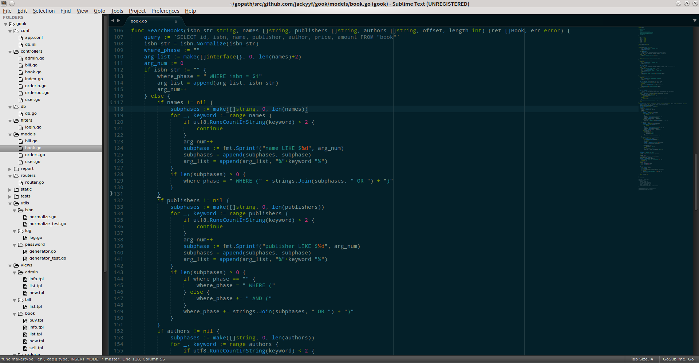

## 3 数据库设计

  在仔细分析本次实验要求后，我为本次实验设计了5张表，分别为user为用户表, book为存储书目的表, orderin为存储进货订单的表, orderout为存储卖出订单的表, bill为记录资金进出的表。下面是本次数据库的ER图：

  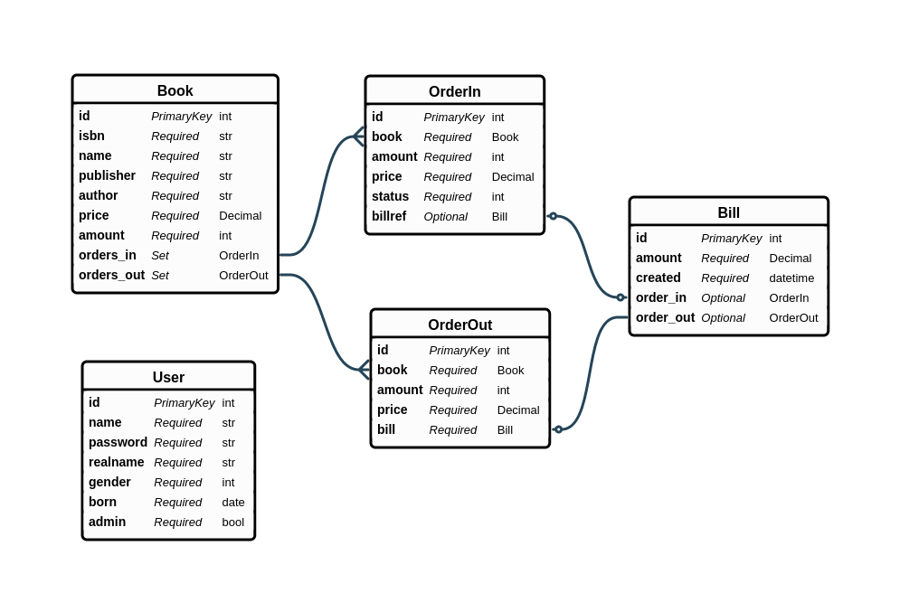

  User表: ID为每个人的工号，是一个自动分配的自增域；name为用户名，作为登录的唯一识别标识；password内存储的是使用bcrypt加密的密码，由于本次是实验性质故本次bcrypt的负载因子开的较小(8)以节约计算时间，每个密码的生成时间约为50ms(i5 4460 @ 3.2GHz)，默认负载因子(10)下为200ms左右；realname为用户的真实姓名；gender为用户的性别；born为用户的出生日期；admin表示用户是否为超级管理员

  Book表：ID为每本书的一个序列号，为一个自动分配的自增域；ISBN为书本的ISBN号，定长13位，存入数据库前会验证ISBN的有效性，10位ISBN会自动重新根据规则升为13位后存储；name为书的标题；publisher为书的出版社；author为书的作者；name, publisher和author都做了索引以方便搜索；price为书的价格；amount为书的库存；
  
  Bill表：ID为每个收支的一个流水号；amount为这笔收支的金额，正数表示收入，负数表示支出；created为该笔收支的完成时间

  OrderIn表：ID为每个订单的流水号，为一个自动分配的自增域；book为一个OrderIn多对一到Book的关系，amount为当前进货订单的数量，price为每本书的进价，status表示当前订单状态，-1为取消，0为新创建，1为已付款，2为已完成(已到货)，billref为一个OrderIn一对一的关系，billref可能为null(status为0或者-1)

  OrderIn表：ID为每个订单的流水号，为一个自动分配的自增域；book为一个OrderIn多对一到Book的关系，amount为当前进货订单的数量，price为每本书的进价，billref为一个OrderIn一对一的关系

## 4 系统设计

  1. 未登录用户访问任何页面都将被重定向至登录页面：

  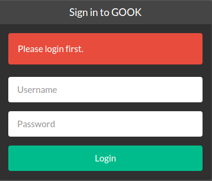

  登录后如果为管理员右上角有Admin按钮：

  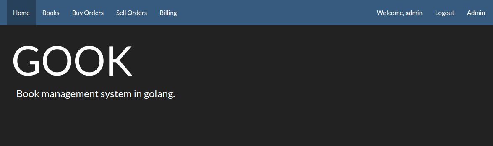

  普通用户则不会显示：

  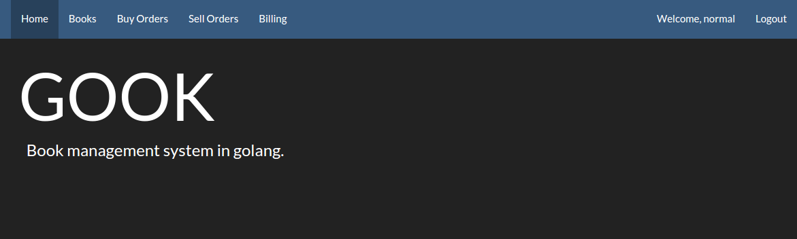

  用户密码均以bcrypt哈希加密后存储于数据库中：

  

  2. 所有登录用户均可创建，查看/搜索，修改库中的图书：

  图书列表/搜索：

  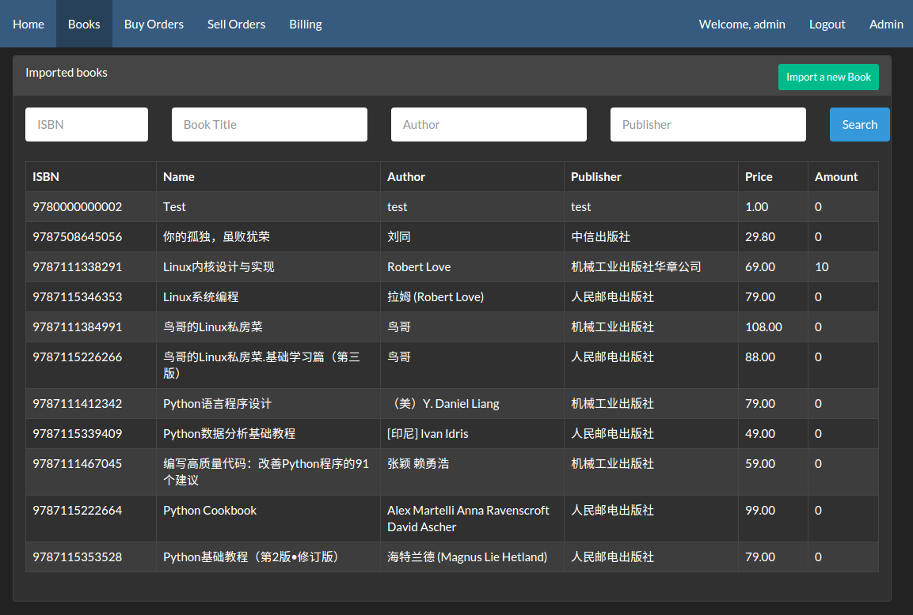

  新建图书：

  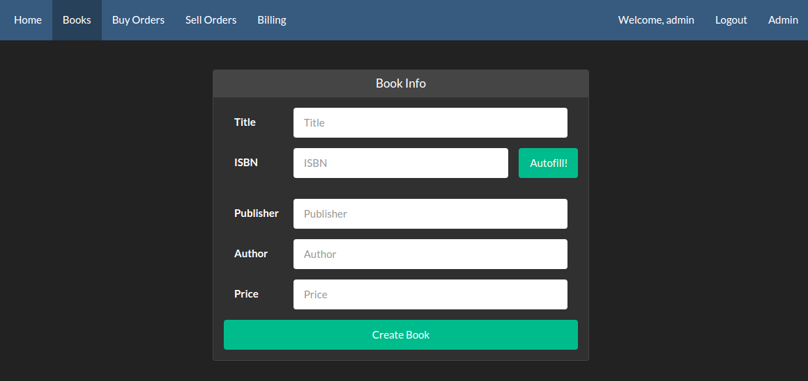

  值得一提的是，为了方便导入书目，用户只需要填入10位或者13位ISBN号后使用Autofill，我们就会自动尝试去豆瓣数据库中补全剩余的图书信息，能够大大减轻导入的压力。

  查看/修改图书：

  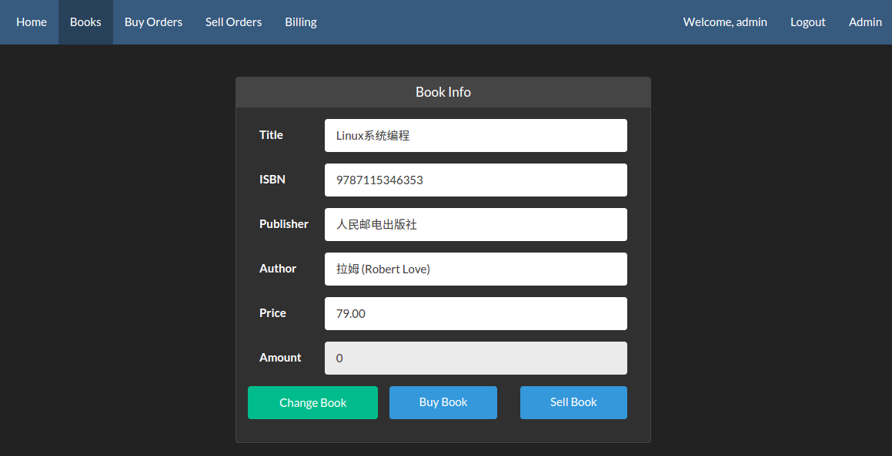

  在图书信息页面，可以修改当前书目的信息，也可以购入或者卖出该本书。

  3. 在图书信息页面点击购入书目会跳转到创建订单页面：

  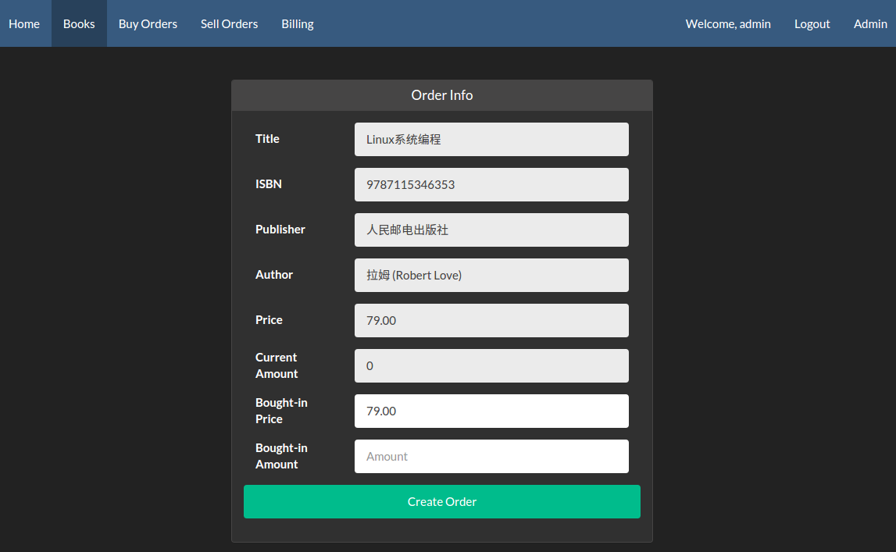

  订单创建页面上方为书本的基本信息，下面为进货单价和数量。

  在创建订单后会跳转到订单信息页面：

  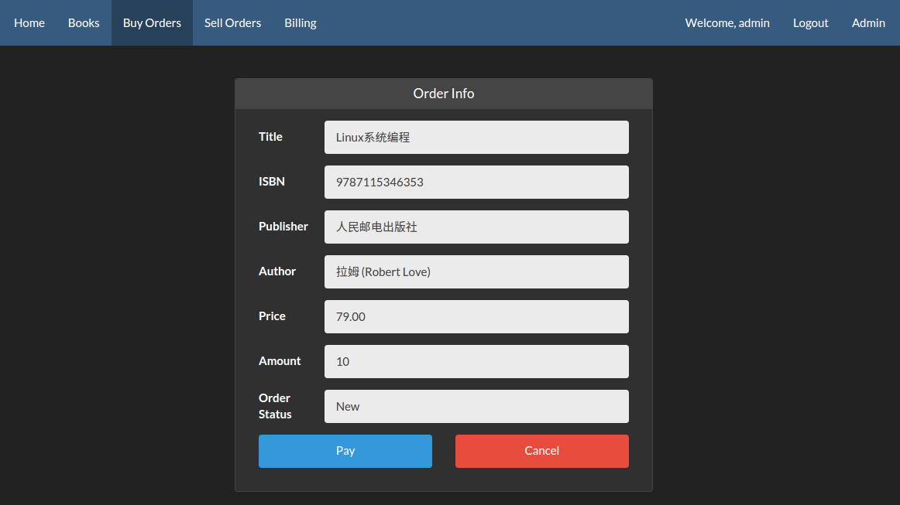

  新创建的订单可以付款，也可以取消：

  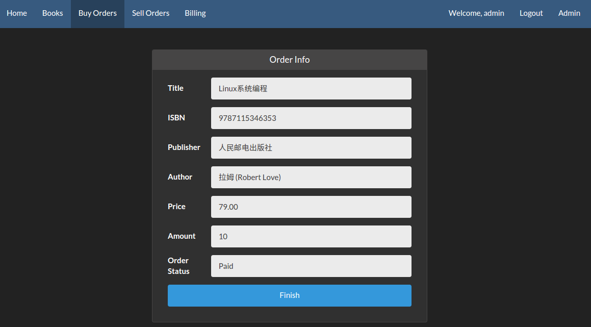

  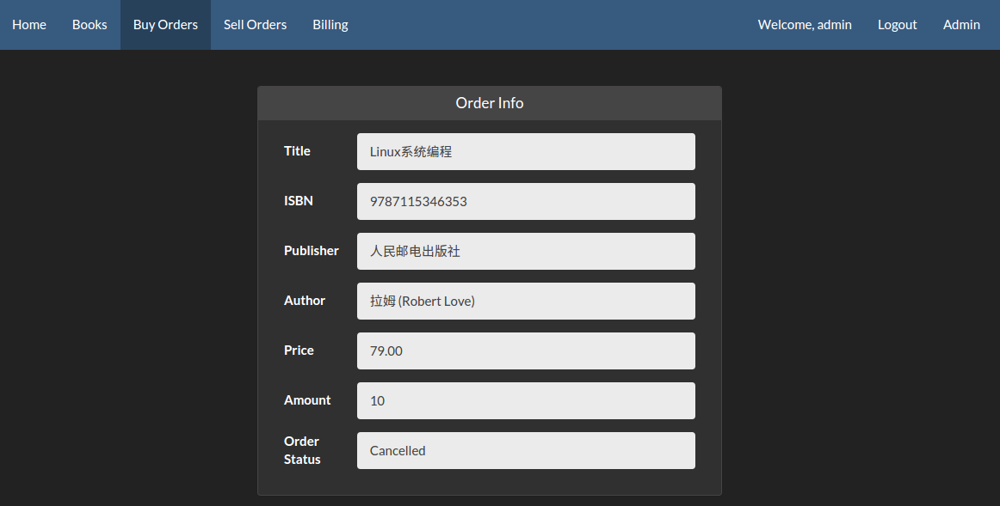

  付款的订单可以完成付款加入库存：

  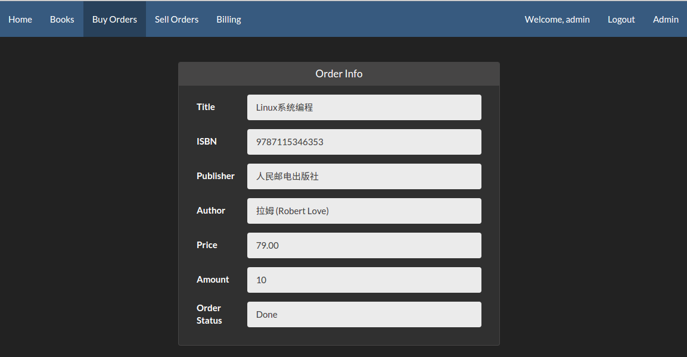

  所有进货订单都有列表显示，可以点击进入查看每个订单的情况：

  

  4. 在图书信息页面点击售出书目会跳转到创建订单页面：

  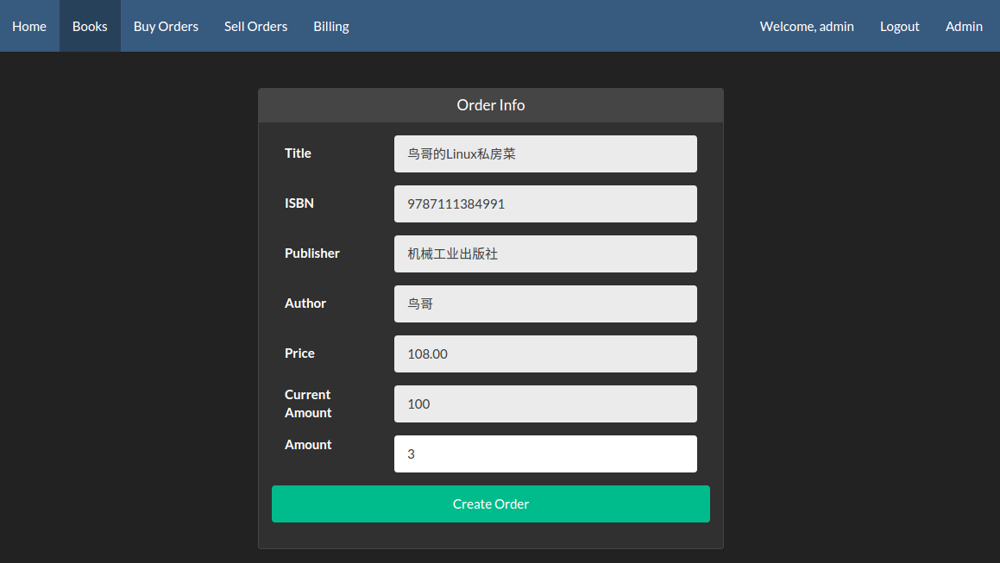

  订单创建页面上方为书本的基本信息，下面为卖出数量。

  在创建订单后订单立即生效，并会跳转到订单信息页面：

  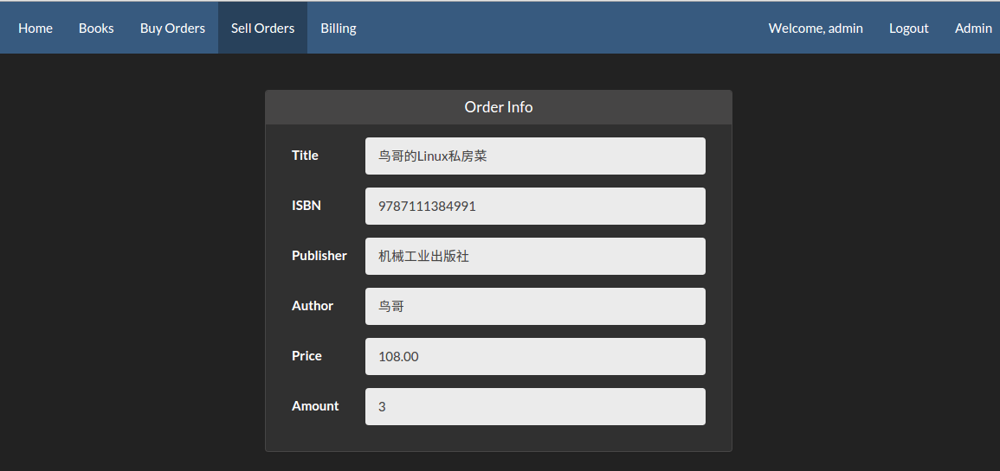

  如果尝试购买的数量超过库存则会提示错误：

  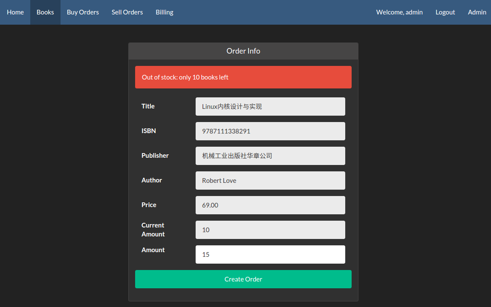

  所有售出订单都有列表显示，可以点击进入查看每个订单的情况，此处售价不受书本修改影响：

  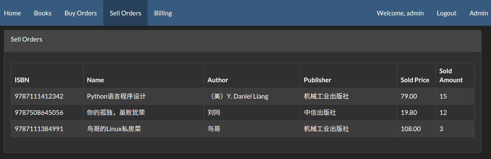

  5. 收支页面可以查看当前总体收支统计，也可查看特定时间段的收支统计：

  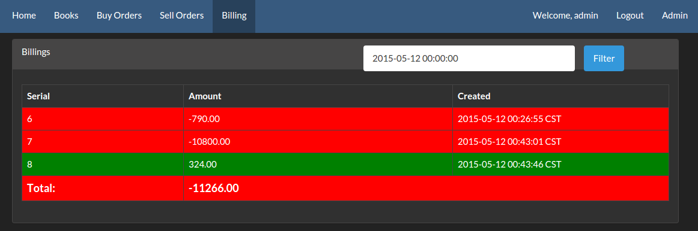

  6. 管理员可以查看所有用户：

  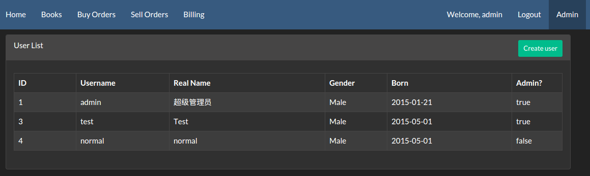

  新建一个用户：

  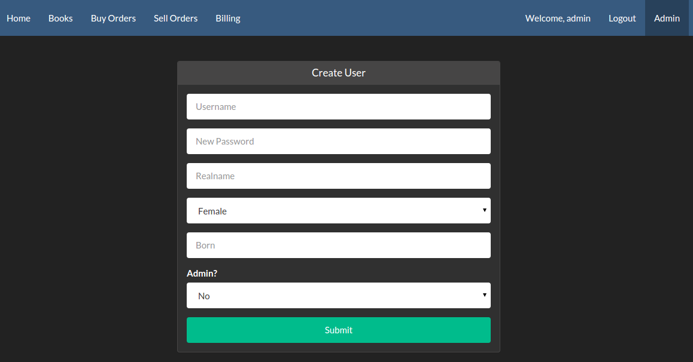

  查看、修改或删除一个用户：

  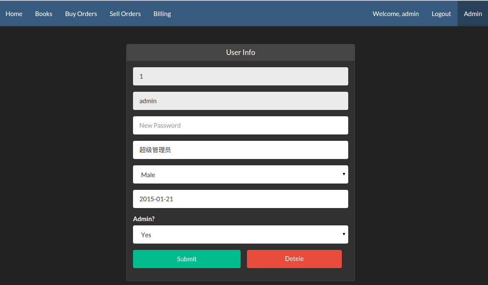

## 5 项目特点/创新

  1. 使用golang进行开发，并发能力强，在高负载下也能正常稳定高效工作

  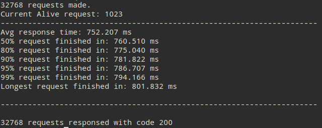

  在1024并发测试环境下，仍然能够做到0错误，可见服务器本身十分稳定。请求等待时间为750ms，99% worth为790ms，换算出来每个请求只花费了800μs的时间处理，并且变化范围极小，十分稳定高效。

  2. 通过ISBN自动补全书本信息，只需手动修改极少部分

  3. 后台验证ISBN合法性，对于10位版ISBN自动升为13位存入数据库

  4. 使用了高强度的密码Hash算法，每次暴力约需要0.1CPU秒，故希望通过暴力枚举破解密码几乎不可能，最大程度保证用户数据安全

  5. 在程序中使用了逻辑判断，在数据库中也使用了约束，以保证数据不会出现错误

## 6 文件说明

  本次所有代码均在https://github.com/jackyyf/gook可以获取。

  目录结构：
    
  1. conf/ 为配置文件所在目录，app.conf默认已经配好可以不用修改，db.ini按照本地配置修改即可

  2. controllers/ 为逻辑处理模块所在目录，每份代码分别处理一个模块，使用AutoRouter进行按照方法名路由

  3. db/ 为数据库驱动所在目录，里面为一个自己编写的数据库封装，在启动时自动初始化

  4. filters/ 为过滤器所在目录，负责在每个请求到达前进行分析判断以及请求上下文的初始化

  5. models/ 为数据模块所在目录，为数据库内容在程序中的驱动层以及抽象表示

  6. report/ 为本报告目录

  7. routers/ 为路由模块目录，负责处理分发url到各个controller

  8. static/ 为静态文件目录，包括js, css, 图片和字体等

  9. utils/ 为自己编写的小模块，封装具体功能，方便程序中使用

  10. views/ 为模板存放目录，controllers最终渲染views中的模板返回给用户

  11. init.go 为一个初始化脚本，负责根据conf中数据库的配置完成数据库的初始化工作(会清除之前存在的数据)

  12. main.go 为整个网站的入口，使用go run main.go启动

## 7 实验总结

  本次实验是我在系统学习数据库后的第一个从头开始，从设计，编写，调试都自己完成的一个项目。在高中时也尝试过类似的项目，然而当时对数据库的一知半解导致最终的代码漏洞百出，最终被迫放弃了维护。  
  本次实验就内容要求来说算是比较轻松的，没有复杂的数据依赖，也没有十分复杂的处理流程分支，因而最终完成的网站也仅在调试中发现数个笔误，没有严重的逻辑问题。完成本次数据库实验以后，对SQL的各种语法的使用也十分的熟悉，也能使用一些高级功能如transaction, prepare等完成自己需要的功能。  
